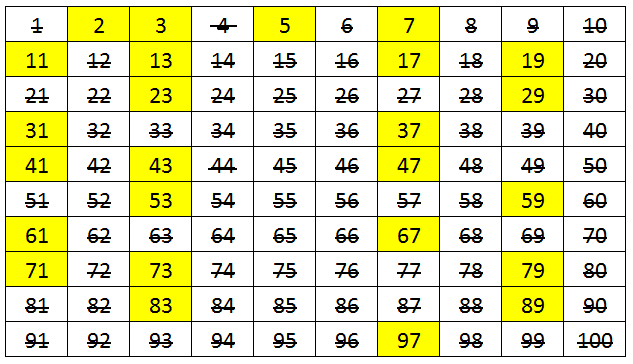

# Interpretador

Projeto exploratório/estudos

O intuito é ter um interpretador ruby para uma nova linguagem

input.file contém o programa nessa nova linguagem
e serve para saber se o numero digitado é primo

 - clone o repositório
```
git clone https://github.com/xitarps/interpretador_primos
```

 - entre na pasta do projeto
```
cd ./interpretador_primos
```

 - libere permissão de execução

```
sudo chmod +x ./interpreter.rb
```

 - rode um programa na linguegem nova(ex: input.file, que descobre se um numero é primo)
```
ruby ./interpreter.rb input.file
```

O programa input.file espera que se entre um numero e de enter para responder se é primo ou não

## Exemplos numeros primos


## Instruções nova linguagem (Wip / work in progress)

| Instrução                  | Semântica                                                                                                                                  |
|----------------------------|--------------------------------------------------------------------------------------------------------------------------------------------|
| keyboard                   | leia um valor do teclado e coloque no topo da pilha |
| push <value>               | empilha o valor constante passado como parâmetro |
| pop                        | retire o valor do topo da pilha |
| print                      | mostre no monitor o valor armazenado no topo da pilha |
| sum                        | desempilhe duas vezes e some os valores. Empilhe o resultado |
| subtract                   | desempilhe duas vezes e subtraia o primeiro do segundo valor. Empilhe o resultado |
| multiply                   | desempilhe duas vezes e multiplique os valores. Empilhe o resultado |
| divide                     | desempilhe duas vezes e divida os valores. Empilhe o resultado |
| module                     | desempilhe duas vezes e calcule o modulo da divisão dos valores. Empilhe o resultado |
| greater_than               | desempilha duas vezes e compara se o segundo valor desempilhado é maior ou igual que primeiro. Empilha o resultado da comparação|
| greater                    | desempilha duas vezes e compara se o segundo valor desempilhado é maior que primeiro. Empilha o resultado da comparação|
| less_than                  | desempilha duas vezes e compara se o segundo valor desempilhado é menor ou igual que primeiro. Empilha o resultado da comparação o resultado|
| less                       | desempilha duas vezes e compara se o segundo valor desempilhado é menor que primeiro. Empilha o resultado da comparação|
| equal                      | desempilha duas vezes e compara se o segundo valor desempilhado é igual ao primeiro. Empilha o resultado da comparação |
| not_equal                  | desempilha duas vezes e compara se o segundo valor desempilhado é diferente do primeiro. Empilha o resultado da comparação |
| if <condition> <label>     | executa a instrução de condição e se o resultado for verdadeiro salte a execução para o label indicado |
| unless <condition> <label> | executa a instrução de condição e se o resultado for false salte a execução para o label indicado |
| end                        | para a execução do programa
| repeat <condition>         | executa a instrução de condição e se o resultado for verdadeiro executa as próximas instruções até encontrar a instrução end_repeat |
| end_repeat                 | determina o fim do bloco de instruções de uma instrução repeat
| label <name>               | rotula um trecho de código com um nome para que ele possa ser alvo de um desvio de fluxo
| store <name>               | Desempilha e guarda o valor desempilhado uma posição da memória definido pelo parâmetro nome                                            |
| read <name>                | coloca no topo da pilha o valor armazenado em uma posição da memória definido pelo parâmetro nome        
